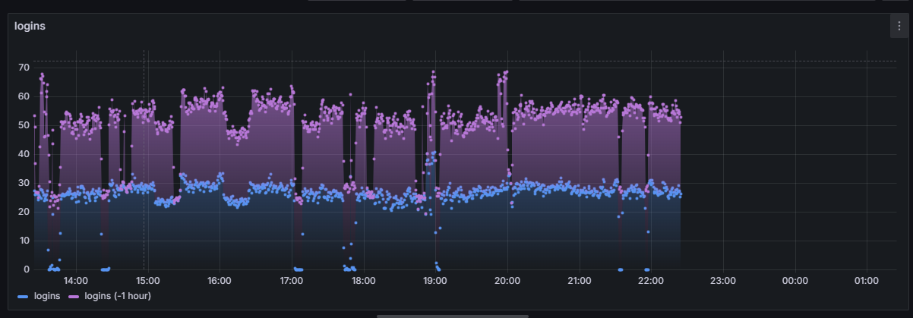
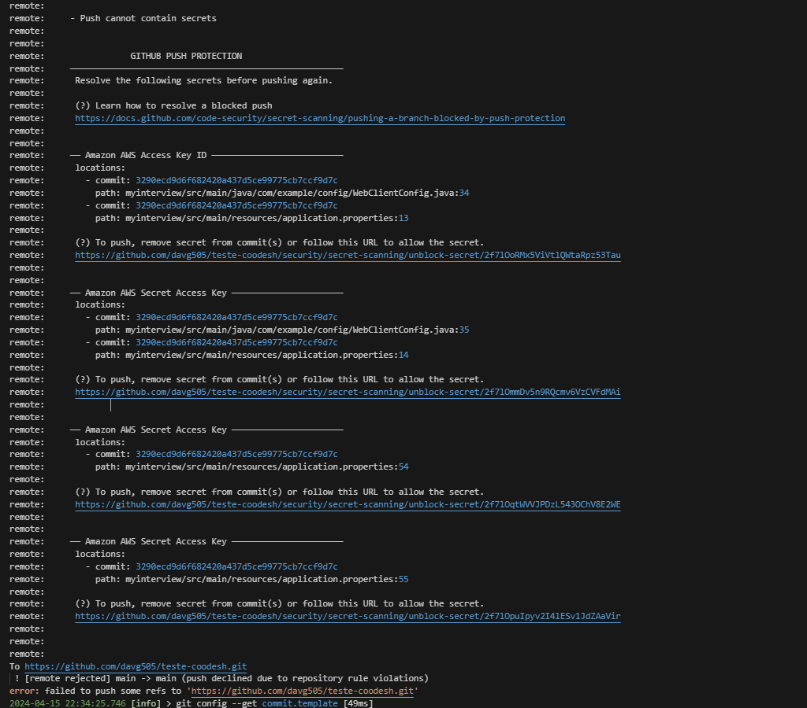

## README

### MyInterviewApplication

Este repositório contém o código para MyInterviewApplication, um projeto Java Spring Boot.

### Tecnologias Utilizadas

- Java
- Spring Boot
- MySQL
- H2
- AWS S3
- Swagger
- Flyway
- JPA

### Instalação e Uso

1. Clone o repositório:
```
git clone https://github.com/davg505/teste-coodesh
  ```

2. Importe o projeto para o seu IDE (por exemplo, IntelliJ, Eclipse, Vscode).

3. Task1 - Ir no arquivo TASK1.java no local do diretorio:src\main\java\com\example\TASKS
- Rodar com RUN JAVA, botão direito do mouse.
- Essa Frase vai aparecer no console "Entra com  valor da string:" , so entra com o valor 
- Nota: Não deve esta executando o spring

4. Task2 - Ir no arquivo TASK2.java no local do diretorio:src\main\java\com\example\TASKS
- Rodar com RUN JAVA, botão direito do mouse.
- Nota: Não deve esta executando o spring

5. Task3 - Ir no arquivo TASK3.java no local do diretorio:src\main\java\com\example\TASKS
- Rodar com RUN JAVA, botão direito do mouse.
- Nota: Não deve esta executando o spring

6. Task4 - Rodar a aplicação e acessar documentação do Swagger.
- Antes no  application.properties adicionar login e senha aws.O motivo disso esta no 10.2 a explicação:
```
cloud.aws.credentials.access-key=${AWS_ACCESS_KEY_ID}
cloud.aws.credentials.secret-key=${AWS_SECRET_ACCESS_KEY}

```
- Execute a classe principal `MyInterviewApplication` para iniciar a aplicação Spring Boot.
- Acessar swagger:
```
http://localhost:8090/swagger-ui/index.html#/

```
- Ir no end-point ContagemGeneroControle. e rodar o metodo get para retorno
Nota:
- Nota: Executando o spring.

7. Task5 e teste sql, configure o banco de dados MySQL:
- Coloquei na aplicação porem conforme erro descrito no 10.1.
- Nota: Se liberar que crie tabela nesse não tem necessidade de usar script pelo motivo queos arquivos estão da pasta db, para utulizaçao do flyway e precisa tirar do comentario aplication.properties
```
# sql
#spring.profiles.active=mysql
#spring.datasource.url=jdbc:mysql://rds-interview.digiage.com.br/employees
#spring.datasource.username=interview
#spring.datasource.password=2MLGz6q5py4mFNII
#spring.datasource.driver-class-name=com.mysql.cj.jdbc.Driver
#spring.jpa.database-platform=org.hibernate.dialect.MySQL5Dialect
#spring.jpa.properties.hibernate.dialect=org.hibernate.dialect.MySQL5InnoDBDialect 

```
- Então para tarefa sql + task5 criei um banco em memoria H2, mas tambem deixei um script em sql

```
# Configuração do banco H2
spring.profiles.active=h2
spring.h2.console.enabled=true
spring.datasource.url=jdbc:h2:mem:h2db
spring.datasource.driver-class-name=org.h2.Driver
spring.datasource.username=sa
spring.datasource.password=password
spring.jpa.database-platform=org.hibernate.dialect.H2Dialect
```

- TASK5 - 
- Execute a classe principal `MyInterviewApplication` para iniciar a aplicação Spring Boot.
- Acessar swagger:
```
http://localhost:8090/swagger-ui/index.html#/

```
- Ir nos end-points FuncionárioControlador. e rodar os metodos para retorno

- Teste SQL.

- criei uma arquivo teste.sql, onde pode usar direto no banco. 
- Fiz tambem rodando no banco H2, onde fiz utilizando flyway.
- Onde pode ver o Script no:
```
 src\main\resources\db

```
- Onde no Swagger. São os end-points que estão FuncionárioControlador  que é 
URL: Retorna a quantidade de funcionários separados por sexo. Retorna a quantidade de funcionários diferentes por sexo, ano e ano de nascimento e Retorna a média, mínimo e máximo de salário por sexo.

- Nesse caso fiz as query direto no repository, Exemplo:

```
@Query("SELECT f.genero, COUNT(f) FROM Funcionario f GROUP BY f.genero")
    List<Object[]> contagemPorGenero();

```

8. Analise do grafico.



- Analisando os logins, podemos observar picos no início da tarde, final da tarde e também à noite, o que pode ser devido às pessoas fazendo logout no final dos seus turnos.

9. Breve descrição sobre mim. 

Sou um entusiasta da tecnologia com experiência sólida em programação e paixão por soluções inovadoras. Tenho experiência Spring Boot, Java e GitLab, além de habilidades em administração de bancos de dados e criação de  Atualmente, cursando Gestão de Tecnologia da Informação na Fatec de Campinas e Arquitetura de Software Distribuído na PUC-Minas, continuo a aprimorar meus conhecimentos. Estou sempre em busca de desafios para aplicar minhas habilidades e continuar aprendendo.


10. Problemas
* 10.1 - Ia implatar a task5 com tarefa com sql porem sql não tem autorização de crair tabela 
- conforme exsemplo (estou utilzando flyway para melhor controle de alteração no bando de dados):
```
Caused by: org.flywaydb.core.internal.sqlscript.FlywaySqlScriptException: Migration  failed
-----------------
SQL State  : 42000
Error Code : 1142
Message    : INSERT, CREATE command denied to user 'interview'@'187.106.34.23' for table 'flyway_schema_history'
Location   :  ()
Line       : 1
Statement  : CREATE TABLE `employees`.`flyway_schema_history` (
    `installed_rank` INT NOT NULL,
    `version` VARCHAR(50),
    `description` VARCHAR(200) NOT NULL,
    `type` VARCHAR(20) NOT NULL,
    `script` VARCHAR(1000) NOT NULL,
    `checksum` INT,
    `installed_by` VARCHAR(100) NOT NULL,
    `installed_on` TIMESTAMP NOT NULL DEFAULT CURRENT_TIMESTAMP,
    `execution_time` INT NOT NULL,
    `success` BOOL NOT NULL,
    CONSTRAINT `flyway_schema_history_pk` PRIMARY KEY (`installed_rank`)
) ENGINE=InnoDB AS SELECT     1 as "installed_rank",     '1' as "version",     '<< Flyway Baseline >>' as "description",     'BASELINE' as "type",     '<< Flyway Baseline >>' as "script",     NULL as "checksum",     'interview' as "installed_by",     CURRENT_TIMESTAMP as "installed_on",     0 as "execution_time",     TRUE as "success"

```
* 10.2 - Problema 10.2: Investigando o motivo do erro ao especificar o usuário e senha da S3 Amazon no arquivo application.properties.

 


### Diretrizes de Contribuição

- Todas as contribuições e dicas são bem-vindas.
- Por favor, relate quaisquer problemas ou melhorias ao rastreador de problemas do repositório.

### Observação

Este é um desafio da [Coodesh](https://coodesh.com/).

